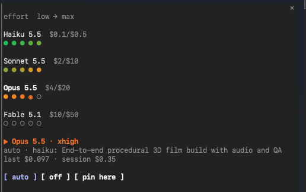

<p align="center">

```
███╗   ███╗ ██████╗ ██████╗       ███████╗ ██████╗ ██╗   ██╗ █████╗ ██████╗ 
████╗ ████║██╔═══██╗██╔══██╗      ██╔════╝██╔═══██╗██║   ██║██╔══██╗██╔══██╗
██╔████╔██║██║   ██║██║  ██║█████╗███████╗██║   ██║██║   ██║███████║██║  ██║
██║╚██╔╝██║██║   ██║██║  ██║╚════╝╚════██║██║▄▄ ██║██║   ██║██╔══██║██║  ██║
██║ ╚═╝ ██║╚██████╔╝██████╔╝      ███████║╚██████╔╝╚██████╔╝██║  ██║██████╔╝
╚═╝     ╚═╝ ╚═════╝ ╚═════╝       ╚══════╝ ╚══▀▀═╝  ╚═════╝ ╚═╝  ╚═╝╚═════╝ 
                                                                           

**Small mods for [Claude Code](https://claude.com/claude-code): live panes, guards and smarter defaults.**
```
</p>

> The mod API is early access and may change between Claude Code releases. Mods run in the Claude Code terminal; they are installed from a terminal session.

## Install

```
/plugin marketplace add troyjlorents-gh/mod-squad
/plugin install <mod>@mod-squad
```

## The squad

| Mod | What it does |
| --- | --- |
| [`model-router`](mods/model-router) | Picks the cheapest model + effort for every turn (Haiku 5.5 → Sonnet 5.5 → Opus 5.5 → Fable 5.1) and draws a live green → red cost ladder in a side pane. |

More on the way.

### model-router



Every lit dot is a rung at or below what is running now; the shaded `◉` is the current model + effort. Below the ladder: why it was picked, what the last turn cost, and the running session total.

## Build your own mod

A mod is a folder in `mods/<name>/`:

```
mods/<name>/
  .claude-plugin/plugin.json
  hooks/hooks.json
  hooks/register.tsx
  tests/*.test.ts
```

List it in `.claude-plugin/marketplace.json`, then:

```
claude plugin validate mods/<name>
claude plugin test mods/<name>
```
